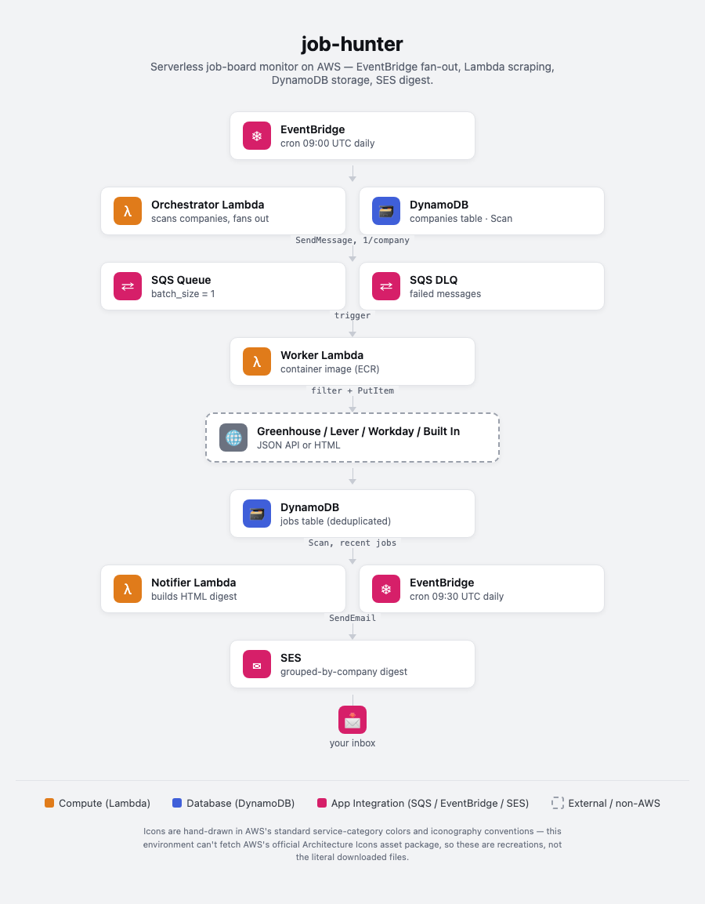

# job-hunter

Automated job board monitor. An EventBridge cron fans out one Lambda per company to scrape careers pages, deduplicates results in DynamoDB, and emails a daily digest via SES.

The worker supports four scraping backends:
- **Greenhouse / Lever / Workday** — direct JSON API calls
- **Built In** — scrapes a Built In (builtin.com) search results page (server-rendered HTML); since it aggregates postings across many employers, each job carries its own company name and postings from companies already tracked directly elsewhere in `companies.json` are skipped

Beyond ATS-specific scraping, every job is passed through a relevance filter before being written to DynamoDB: it must match a target-role keyword (platform/SRE/DevOps/cloud/infrastructure/staff engineer), must not look like a management role, must not require a security clearance above Public Trust, must not be a non-US posting, and must match a configurable location/work-type preference (defaults to remote-only — see [Configuration](#configuration)). See `worker/handler.py:_filter_relevant_jobs`.

## Architecture

<picture>
  <source media="(prefers-color-scheme: dark)" srcset="docs/architecture-dark.png">
  
</picture>

## DynamoDB Tables

### `job-hunter-companies`
| Attribute    | Type | Role          |
|-------------|------|---------------|
| company_name | S    | Partition key |
| careers_url  | S    | Careers page URL |
| ats          | S    | ATS backend (`greenhouse`, `lever`, `workday`, or `builtin`) |

### `job-hunter-jobs`
| Attribute     | Type | Role          |
|--------------|------|---------------|
| job_id        | S    | Partition key — SHA-256 of `company\|title\|url` |
| company       | S    | Company name |
| title         | S    | Job title |
| url           | S    | Job posting URL |
| location      | S    | Location string |
| discovered_at | S    | ISO-8601 timestamp |

## Project Layout

```
job-hunter/
├── pyproject.toml              # uv workspace root
├── .python-version             # 3.13
├── .pre-commit-config.yaml
├── .tflint.hcl                 # tflint AWS ruleset config
├── Taskfile.yml                # operational tasks (see below)
├── companies/
│   └── companies.json          # seed data for the companies table
├── .github/
│   └── workflows/ci.yml
├── src/
│   ├── conftest.py             # sets fake AWS creds at module level for pytest
│   ├── orchestrator/
│   │   ├── pyproject.toml
│   │   ├── orchestrator/
│   │   │   └── handler.py
│   │   └── tests/
│   │       └── test_handler.py
│   ├── worker/
│   │   ├── Dockerfile          # container image Lambda
│   │   ├── pyproject.toml
│   │   ├── worker/
│   │   │   └── handler.py
│   │   └── tests/
│   │       └── test_handler.py
│   └── notifier/
│       ├── pyproject.toml
│       ├── notifier/
│       │   └── handler.py
│       └── tests/
│           └── test_handler.py
└── terraform/
    ├── main.tf                 # all resources (IAM, Lambda, SQS, DynamoDB, ECR, EventBridge)
    ├── versions.tf
    ├── providers.tf
    ├── backend.tf
    ├── variables.tf
    └── outputs.tf
```

## Local Development

```bash
# Install uv (https://docs.astral.sh/uv/)
curl -LsSf https://astral.sh/uv/install.sh | sh

# Install all workspace packages + dev deps
uv sync --all-packages

# Run tests
uv run pytest

# Lint + format
uv run ruff check src/
uv run ruff format src/

# Type check
uv run ty check src/

# Install pre-commit hooks
uv run pre-commit install
uv run pre-commit install --hook-type pre-push  # for pytest
```

## Infrastructure

Deploys are managed via [Task](https://taskfile.dev). The Terraform backend is configured via a gitignored `terraform/backend.hcl` file.

### First-time setup

```bash
# 1. Create terraform/backend.hcl with your S3 state bucket details
cat > terraform/backend.hcl <<EOF
bucket = "your-terraform-state-bucket"
key    = "job-hunter/terraform.tfstate"
region = "us-east-1"
EOF

# 2. Create terraform/terraform.tfvars with required variables
cat > terraform/terraform.tfvars <<EOF
ses_from_address = "you@yourdomain.com"
ses_to_address   = "you@yourdomain.com"
EOF

# 3. Deploy
task apply    # terraform init + apply (creates ECR, builds & pushes worker image, then full apply)
```

### Task reference

| Task | Description |
|------|-------------|
| `task apply` | Build all artifacts and deploy infrastructure |
| `task destroy` | Destroy all infrastructure |
| `task build` | Build orchestrator and notifier Lambda ZIPs |
| `task build-worker` | Build and push the worker container image to ECR |
| `task ecr-login` | Authenticate Docker to ECR |
| `task invoke` | Full end-to-end test: orchestrator → workers → notifier |
| `task logs-worker` | Print the worker Lambda's most recent CloudWatch log streams |
| `task seed` | Seed the DynamoDB companies table from `companies/companies.json` |
| `task flush-jobs` | Delete all items from the DynamoDB jobs table |
| `task dynamo-disable-protection` | Disable deletion protection on the companies table (run before `destroy`) |
| `task ecr-delete-images` | Delete all images from the worker ECR repository (run before `destroy`) |

### Teardown

DynamoDB deletion protection and a non-empty ECR repository will cause `terraform destroy` to fail. Run these first:

```bash
task dynamo-disable-protection
task ecr-delete-images
task destroy
```

## Seeding Companies

Edit `companies/companies.json` and run:

```bash
task seed
```

Each entry requires `company_name`, `careers_url`, and `ats` (`greenhouse`, `lever`, `workday`, or `builtin`):

```json
[
  {"company_name": "Acme Corp", "careers_url": "https://boards-api.greenhouse.io/v1/boards/acme/jobs", "ats": "greenhouse"}
]
```

## Configuration

Set these in `terraform/terraform.tfvars` (see `terraform/variables.tf` for the full list, including Lambda sizing/timeouts and cron schedules). All have defaults, so none are required.

| Variable | Default | Purpose |
|---|---|---|
| `location` | `""` (disabled) | Location substring to additionally keep, for every backend except `builtin` |
| `work_type` | `"remote"` | Work-type keyword to keep (`remote`, `hybrid`, `office`, `any`, or any literal substring), for every backend except `builtin` |
| `builtin_location` | `""` (disabled) | Same as `location`, but for the `builtin` backend only — independent setting |
| `builtin_work_type` | `"remote"` | Same as `work_type`, but for the `builtin` backend only — independent setting |

`location`/`work_type` and `builtin_location`/`builtin_work_type` are deliberately separate: the curated company list often includes companies chosen for proximity to a specific place (e.g. a planned relocation), so a hybrid/on-site preference there shouldn't share Built In's broad-discovery "remote only" default. A job passes if it matches *either* the configured location *or* the work type (not both) — e.g. with `location = "Reston, VA"` and `work_type = "remote"`, both a Reston-based posting and a fully-remote posting anywhere would pass.

## CI

Pull requests run two jobs: **pre-commit** (ruff, ty, terraform fmt/validate/docs/tflint/checkov) and **Tests** (pytest). All must pass before merge.
